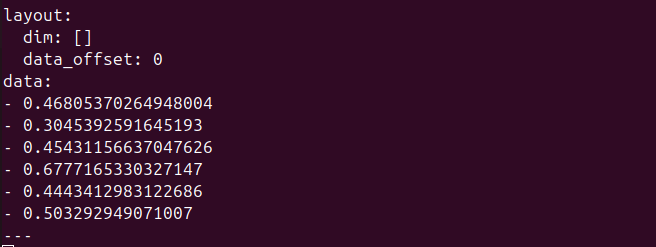
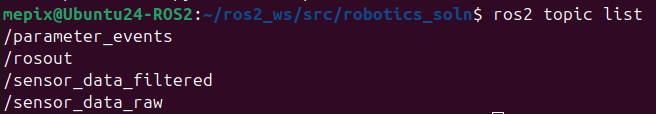

# Robotic_SOLN

## Overview

This project addresses the task set forth in the [problem statement](./PROBLEM_STATEMENT.md) to connect to a mock 3-DOF sensor and broadcast data using ROS2.

This was developed and tested on Ubuntu 24.04 (arm64) in a VirtualBox on Apple Silicon.  No other platforms have been tested! ;-)

## Setup

Create a ROS2 workspace and place this pacakge in the `/src` directory.  You **must** also install the `robotics_soln_msgs` package from [this repo](https://github.com/mepix/robotics_soln_msgs) which defines custom msgs and services for this project.

```
+ros2_ws
|
+-- src
    |
    +-- robotics_soln
    +-- robotics_soln_msgs
```

After cloning the this repo and the `robotics_soln_msgs` pacakge into `src`, build and setup the environment:

```sh
colcon build
source install/setup.bash
```

## Launching Services

### Batch Launch

The ROS2 nodes can be launched with a single launch script (**recommended!**):

```sh
ros2 launch robotics_soln sensor_stack.py
```

This will bring up the mock sensors, two sensor services (one for each mock sensor), and one client to publish the filtered data to a single topic.

### Individual Launch

The ROS2 nodes can be launched invidiually (mostly for **debugging**):

```sh
# bring up the sensor
ros2 run robotics_soln sensor

# bring up the service
ros2 run robotics_soln sensor_service 

# bring up the client
ros2 run robotics_soln sensor_client
```

## Retrieving Filtered Data

The filtered sensor data is published on topic `/sensor_data_filtered`.  This is a 6-element `float64` array.  Elements 0-2 are for `sensor0` and elements 3-5 are for `sensor1`.

```sh
ros2 topic echo /sensor_data_filtered
```




```sh
# View additional topics 
ros2 topic list
```

